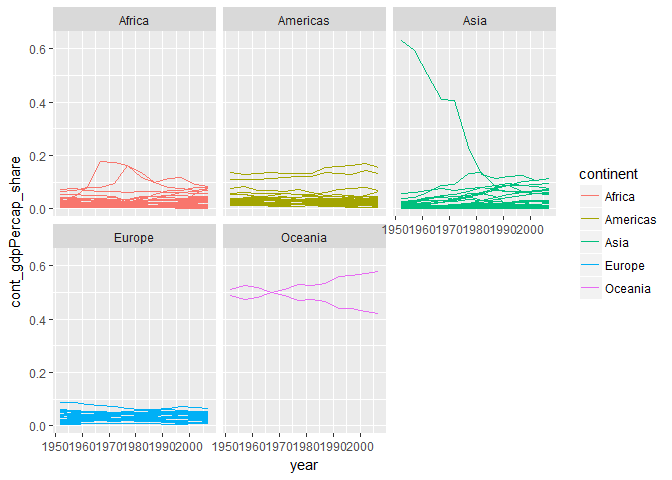

hw01\_gapminder
================
IG
September 14, 2017

Main
====

``` r
library(tidyverse)
```

    ## Loading tidyverse: ggplot2
    ## Loading tidyverse: tibble
    ## Loading tidyverse: tidyr
    ## Loading tidyverse: readr
    ## Loading tidyverse: purrr
    ## Loading tidyverse: dplyr

    ## Conflicts with tidy packages ----------------------------------------------

    ## filter(): dplyr, stats
    ## lag():    dplyr, stats

``` r
library(gapminder)

gap_gdpPercap <- gapminder %>% 
  group_by(continent, year) %>% 
  summarise(cont_gdpPercap = sum(gdpPercap)) %>% 
  ungroup

str(gap_gdpPercap)
```

    ## Classes 'tbl_df', 'tbl' and 'data.frame':    60 obs. of  3 variables:
    ##  $ continent     : Factor w/ 5 levels "Africa","Americas",..: 1 1 1 1 1 1 1 1 1 1 ...
    ##  $ year          : int  1952 1957 1962 1967 1972 1977 1982 1987 1992 1997 ...
    ##  $ cont_gdpPercap: num  65134 72032 83100 106619 121660 ...

``` r
gapminder %>% 
  left_join(gap_gdpPercap) %>% 
  mutate(cont_gdpPercap_share = gdpPercap / cont_gdpPercap) %>% 
  ggplot( aes(x=year, 
              y=cont_gdpPercap_share, 
              group=country, 
              colour=continent)) + 
  geom_line() + 
  facet_wrap(~continent )
```

    ## Joining, by = c("continent", "year")



-   Original example was taken from [Fabian Held web page](http://www.fabianheld.com/r-tidyverse/) and adjusted.
